# Examinationsuppgift A3 - Tjugoett

## Introduktion

I denna examinationsuppgift ska du skapa en applikation som simulerar kortspelet Tjugoett ___enligt givna regler___.

Du behöver inte fundera närmare på vilka klasser, attribut och operationer (eller deras synlighet) din lösning ska bestå av då allt redan är bestämt i form av ett klassdiagram.

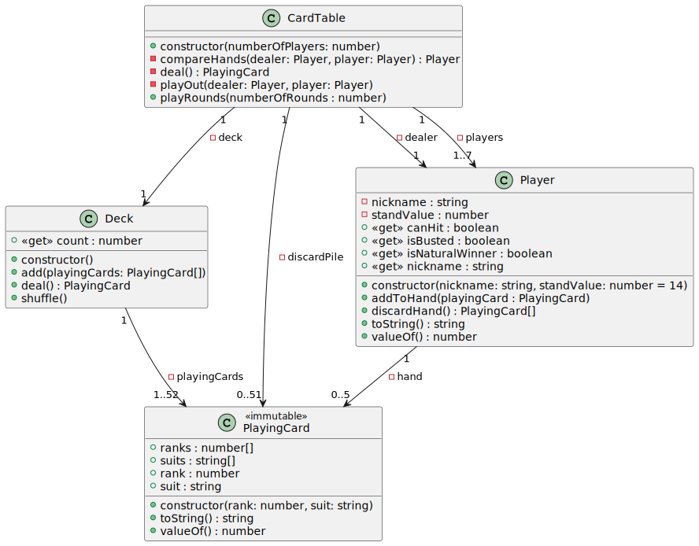

Du måste till fullo följa och implementera klassdiagrammet och inte göra några som helst avsteg från det.

Du ha stor frihet välja hur du internt implementerar klassernas olika medlemmar, vilka konstruktioner att använda, så länge som du följer klassdiagrammet.

Några moduler finns redan skapade `src/app.js`, `src/Deck.js`, `src/PlayingCard.js`. Beroendediagrammet visar beroendet mellan dessa moduler samt ytterligare moduler som kan härledas från klassdiagrammet.

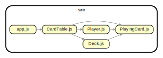

Modulen `src/PlayingCard.js` exporterar den fullständigt implementerade klassen `PlayingCard`, som representerar spelkort. Det går inte att modifiera ett skapat objekt instansierat av klassen `PlayingCard` på något sätt då det är oföränderligt ("immutable"). Ett `PlayingCard`-objekt har egenskaperna `rank` (valör) och `suit` (färg). Metoderna `toString` och `valueOf` kan användas för att få en textrepresentation respektive primitivt värde av ett objekt.

Klassen `Deck`, i modulen `src/Deck.js`, är påbörjad men inte komplett, och innehåller egenskapen `playingCards`, konstruktorn och metoden `shuffle`, som använder sig av algoritmen _Fisher-Yates Shuffle_ för att blanda samlingen med spelkort klassen kapslar in.

`src/app.js` innehåller exempelkod som visar hur klasserna ovan kan användas för skapa en kortlek som blandats. Denna kod tar du lämpligen bort när du studerat den då den säkerligen inte kommer vara en del av din lösning.

## Klasser och deras medlemmar

Samtliga klasser och deras medlemmar måste implementeras exakt enligt klassdiagrammen. Inga ytterligare klasser eller medlemmar får läggas till.

### CardTable

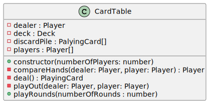

#### Fält

- `dealer`, privat fält som refererar till ett `Player`-objekt representerande given.
- `deck`, privat fält som refererar till det `Deck`-objekt som representerar kortleken (draghögen) kort dras från för att ge till spelare och giv.
- `discardPile`, privat fält för slänghögen, en samling med spelkort.
- `players`, privat fält för spelarna, en samling med referenser till `Player`-objekt.

#### Metoder

- `constructor`, konstruktorns uppgift är att initiera nödvändiga privata medlemmar.
- `compareHands`, privat metod som jämför två spelares händer och returnerar vinnaren.
- `deal`, privat metod som returnerar nästa spelkort från kortleken.
- `playOut`, en spelomgångs delomgång under vilken en spelare drar kort för att given därefter drar sina kort.
- `playRounds`, publik metod vars parameter bestämmer hur många spelrundor som ska spelas. Efter varje spelrundas delomgång ska aktuell delomgångs resultat presenteras.

### Deck

>👉 Denna klass finns redan och är delvis implementerad!

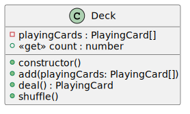

#### Fält

- `playingCards`, privat fält med kortlekens kort, en samling med referenser till `PlayingCard`-objekt.

#### Egenskaper

- `count`, publik "readonly"-egenskap som returnerar antalet kort i kortleken.

#### Metoder

- `constructor`, (👉 REDAN IMPLEMENTERAD) konstruktorns uppgift är att initiera nödvändiga privata medlemmar.
- `add`, publik metod som lägger till kort i slutet av kortleken.
- `deal`, publik metod som tar bort det översta kortet i kortleken och returnerar det.
- `shuffle`, (👉 REDAN IMPLEMENTERAD) publik metod som blandar korten i kortleken.
- `toString`, (👉 REDAN IMPLEMENTERAD) publik metod som returnerar en sträng representerande aktuellt objekt (samtliga kort i kortleken).

### Player

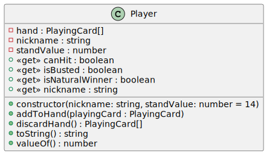

#### Fält

- `hand`, privat fält refererande till en samling innehållande de kort som utgör spelarens hand.
- `nickname`, privat fält för spelarens smeknamn.
- `standValue`, privat fält för det värde på handen upp till och med vilket spelaren fortsätter att dra kort.

#### Egenskaper

- `canHit`, "readonly"-egenskap som returnerar `true` om en spelare vill dra ett kort; annars `false`.
- `isBusted`, "readonly"-egenskap som returnerar `true` om en spelare har spruckit, d.v.s. då handens värde är större än 21; annars `false`.
- `isNaturalWinner`, "readonly"-egenskap som returnerar `true` om en spelare är en naturlig vinnare; annars `false`.
- `nickname`, "readonly"-egenskap som kapslar det privata fältet `nickname`och returnerar en spelares smeknamn.

#### Metoder

- `constructor`, konstruktorns uppgift är att initiera nödvändiga privata medlemmar.
- `addToHand`, publik metod som lägger till ett kort till spelarens hand.
- `discardHand`, publik metod som tar bort samtliga kort från spelarens hand och returnerar dem.
- `toString`, publik metod som returnerar en sträng representerande aktuellt objekt (spelarens namn samt korten spelaren har på sin hand och dess värde, eller ett streck om handen är tom).
- `valueOf`, publik metod som returnerar ett tal  representerande aktuellt objekt (värdet av spelarens hand).

### PlayingCard

>👉 Denna klass finns redan och är fullständigt implementerad och __får inte modifieras__!
>
>👉 Objekt instansierade av klassen är "immutable" (genom `Object.freeze(this)` sist i konstruktorn) och kan inte förändras på något sätt efter att de skapats.


#### Fält

- `ranks`, publikt statiskt fält refererande till en frusen samling av möjliga värden kort kan ha.
- `suits`, publikt statiskt fält refererande till en frusen samling av möjliga färger kort kan ha.

#### Egenskaper

- `rank`, publik egenskap representerande ett korts värde.
- `suit`, publik egenskap representerande ett korts färg.

#### Metoder

- `toString`, publik metod som returnerar en sträng representerande aktuellt objekt (kortets värde följt av dess färg).
- `valueOf`, publik metod som returnerar ett tal  representerande aktuellt objekt (kortets värdet).

## Regler

Samtliga regler måste följas. Inga nya regler får läggas till.

### Kort

En vanlig kortlek om 52 kort används. Esset är värt 1 eller 14 poäng (vilket nu som är mest fördelaktigt för den aktuella handen), en kung är värd 13, en dam 12, en knekt 11 och övriga kort sin valör.

### Spelet idé

I Tjugoett gäller det att komma till, eller så nära som möjligt, summan 21 på två eller flera kort.

### Exempel

Given ger alla spelare ett kort var från draghögen (kortleken). Given tar inte själv något kort. Spelarna spelar nu mot given en i taget i turordning. När det är en spelares tur begär spelaren ett kort av given. Efter spelarens andra kort kan något av följande inträffa:

1. Spelaren har fått 21 och vinner direkt (naturlig vinst).
2. Spelaren har spruckit, d.v.s. fått en summa större än 21, och förlorar direkt.
3. Spelaren begär ytterligare kort tills summan är 21, har fem kort på handen, summan större än 21, eller förklara sig nöjd.
    - Har spelaren fem kort på handen och en summa mindre än 21 vinner spelaren direkt (naturlig vinst).

Om en spelare inte vunnit eller förlorat direkt utan istället förklarat sig nöjd är det givens tur att försöka straffa spelaren. Given drar kort från draghögen, ett efter ett, och något av följande kan inträffa:

1. Given får 21 och vinner.
2. Given har fem kort på handen, en summa mindre än 21 och vinner.
3. Given spricker och spelaren vinner.
4. Given förklarar sig nöjd. Spelaren och given jämför sina händers summor och den som har högst vinner. Om summorna är lika vinner given.

Given fortsätter sedan att spela mot näste spelare på samma sätt. Tar korten i draghögen slut, det understa kortet delas inte ut, tar given det återstående kortet i draghögen samt alla dittills avverka kort, blandar om dem och använder dem som en ny draghög.

## Uppgift

Du ska färdigställa en JavaScript-applikation som simulerar kortspelet Tjugoett ___enligt givna regler___. (#8) Det ska kunna vara en eller flera spelomgångar med en eller flera spelare (antalet spelomgångar och spelare ska bestämmas med hjälp av heltal som skickas in till applikationen i form av argument då den startas (#11 #5)) utöver given. ___Ingen interaktion med användare ska finnas___ (#6) utan både spelare och giv drar kort från draghögen enligt en förutbestämd algoritm utformad enligt ditt eget tycke. Exempelvis kan du välja att en spelare är nöjd då summan uppgår till 15 (eller mer konservativt, och hållbarare i längden(?), 8). Giv och enskilda spelare ska kunna vara nöjda vid olika summor.

Startpunkten för applikationen ska vara i filen `src\app.js`. Samtliga JavaScript-filer ska vara placerade i en katalogstruktur i katalogen `src`.

Din applikation måste följa bifogat klassdiagram till fullo och klasserna ska vara implementerade enligt `class`-syntax. Samtliga klasser ska vara placerade i olika moduler enligt bifogat beroendediagram. (#7)

Antalet spelomgångar och spelare som ska delta ska kunna skickas in som argument till applikationen. Anges inte antalet spelomgångar ska antalet vara en spelomgång som standard. Anges inte antalet spelare ska tre spelare delta som standard.

Anges `npm start` ska en spelomgång spelas där tre spelare utöver given deltar. Anges `npm start 2` ska två spelomgångar spelas där tre spelare utöver given deltar. Anges `npm start 4 7` ska fyra spelomgångar spelas där sju spelare deltar utöver given.

Antalet spelomgångar som skickas som argument måste kunna tolkas som ett heltal i det slutna intervallet mellan 1 och 5. Klarar inte argumentet valideringen ska lämpligt felmeddelande presenteras. (#11)

Antalet spelare som skickas som ett andra argument måste kunna tolkas som ett heltal i det slutna intervallet mellan 1 och 7, samt 52. Klarar inte argumentet valideringen ska lämpligt felmeddelande presenteras. (#5)

Efter varje spelomgång ska resultatet presenteras. Det ska framgå vilka kort spelare och giv dragit, respektive hands summa och vem som vunnit. (#10) Nedan hittar du _förslag_ på presentation av resultatet av olika spelomgångar.

När applikationen avslutas ska en statuskod ges. Statuskoden 0 innebär inget fel inträffade då applikationen exekverades. Anges inte ett korrekt antal spelomgångar ska statuskoden vara 26. Anges inte ett korrekt antal spelare ska statuskoden vara 27. Tar korten slut i draghögen ska statuskoden vara 28. Alla övriga fel ska ge statuskoden 1. (#9)

> Läs hur du sätter en statuskod för en Node.js-applikation i dokumentationen av [process.exit()](https://nodejs.org/api/process.html#process_process_exit_code) och [process.exitCode](https://nodejs.org/api/process.html#process_process_exitcode).

### Icke funktionella krav

Gör tillräckligt många "commits", minst 15, för att det ska vara möjligt att följa hur applikationen vuxit fram över tid. (#1)

All källkod ska följa kursens kodstandard. (#2)

Undvik om lämpligt att upprepa kod och bryt därför inte mot principen DRY ("don't repeat yourself"). (#4)

Dokumentera typer och funktioner genom att använda JSDOC-kommentarer (beskrivning ska finnas och dokumentation av parametrar, kastade undantag och returvärden). Använd även radkommentarer inuti funktioner i de fall det är befogat. (#3)

### Utfall

#### Exempel på utfall vid en spelomgång med en spelare vid bordet

Spelaren och given förklarar sig nöjda och given vinner då given har den högsta summan.

```
> npm start 1 1

> assignment-a3-twenty-one@2.0.0 start
> node src/app.js "1" "1"

--- Round #1 ---------------

Player #1: 6♣ 7♥ 2♣ (15)
Dealer   : 9♥ Kn♠ (20)
Dealer wins! ☹️
```

Spelaren får 21 och vinner direkt.

```
> npm start 1 1

> assignment-a3-twenty-one@2.0.0 start
> node src/app.js "1" "1"

--- Round #1 ---------------

Player #1: A♥ 10♠ A♣ 9♠ (21)
Dealer   : -
Player wins! 🎉
```

Spelaren och given är nöjda och har samma summa på handen varför given vinner.

```
> npm start 1 1

> assignment-a3-twenty-one@2.0.0 start
> node src/app.js "1" "1"

--- Round #1 ---------------

Player #1: 5♣ K♠ (18)
Dealer   : J♣ 7♥ (18)
Dealer wins! ☹️
```

Spelaren nöjd, given spricker varför spelaren vinner.

```
> npm start 1 1

> assignment-a3-twenty-one@2.0.0 start
> node src/app.js "1" "1"

--- Round #1 ---------------

Player #1: 3♦ 7♠ 5♠ (15)
Dealer   : 8♥ 6♥ J♦ (25) BUSTED!
Player wins! 🎉
```

Spelaren spricker varför given vinner direkt.

```
> npm start 1 1

> assignment-a3-twenty-one@2.0.0 start
> node src/app.js "1" "1"

--- Round #1 ---------------

Player #1: 4♣ 9♥ J♥ (24) BUSTED!
Dealer   : -
Dealer wins! ☹️
```

Spelaren drar fem kort och får en summa under 21 och vinner direkt.

```
> npm start 1 1

> assignment-a3-twenty-one@2.0.0 start
> node src/app.js "1" "1"

--- Round #1 ---------------

Player #1: 4♠ 6♦ 2♦ 2♠ 2♥ (16)
Dealer   : -
Player wins! 🎉
```

Spelaren nöjd, given drar fem kort och får en summa under 21 och vinner.

```
❯ npm start 1 1

> assignment-a3-twenty-one@2.0.0 start
> node src/app.js "1" "1"

--- Round #1 ---------------

Player #1: 2♥ 7♣ Kn♠ (20)
Dealer   : 2♠ 5♦ 7♦ A♠ 4♥ (19)
Dealer wins! ☹️
```

#### Exempel på utfall vid en spelomgång med tre spelare vid bordet

```
> npm start 1 3

> assignment-a3-twenty-one@2.0.0 start
> node src/app.js "1" "3"

--- Round #1 ---------------

Player #1: 2♣ 2♦ 6♥ 3♦ 6♦ (19)
Dealer: -
Player #1 wins! 🎉

Player #2: 3♣ A♣ (17)
Dealer: Q♣ 2♥ 5♠ (19)
Dealer wins! ☹️

Player #3: 4♣ A♠ (18)
Dealer: 10♦ Q♠ (22) BUSTED!
Player #3 wins! 🎉
```

#### Exempel på utfall vid en spelomgång med fem spelare vid bordet

```
> npm start 1 5

> assignment-a3-twenty-one@2.0.0 start C:\1dv025\assignment-a3-twenty-one
> node src/app.js "1" "5"

--- Round #1 ---------------

Player #1: 2♣ 9♣ K♥ (24) BUSTED!
Dealer: -
Dealer wins! ☹️

Player #2: 3♣ 7♣ 8♣ (18)
Dealer: 10♠ 8♦ (18)
Dealer wins! ☹️

Player #3: 4♣ 10♣ A♦ (15)
Dealer: 6♠ 9♥ (15)
Dealer wins! ☹️

Player #4: 5♣ 7♠ J♥ (23) BUSTED!
Dealer: -
Dealer wins! ☹️

Player #5: 6♣ 4♦ A♠ 8♠ (19)
Dealer: 7♦ J♠ (18)
Player #5 wins! 🎉
```

#### Exempel på utfall vid två spelomgångar med två spelare vid bordet

```
> npm start 2 2

> assignment-a3-twenty-one@2.0.0 start
> node src/app.js "2" "2"

--- Round #1 ---------------

Player #1: A♥ A♦ (15) 
Dealer: 6♥ 6♦ 7♠ (19)
Dealer wins! ☹️

Player #2: A♣ 4♣ (18)
Dealer: 3♣ 8♣ 4♠ K♥ (28) BUSTED!
Player #2 wins! 🎉

--- Round #2 ---------------

Player #1: J♣ 2♥ 5♥ (18)
Dealer: Q♦ Q♥ (24) BUSTED!
Player #1 wins! 🎉

Player #2: 8♥ 7♥ (15)
Dealer: 10♦ 10♠ (20)
Dealer wins! ☹️
```

#### Exempel på utfall vid felaktigt antal spelomgångar

```
> npm start 12 1

> assignment-a3-twenty-one@2.0.0 start C:\1dv025\assignment-a3-twenty-one
> node src/app.js "12" "1"

Error: Invalid number of rounds
    at ...
    at ModuleJob.run (node:internal/modules/esm/module_job:198:25)
    at async Promise.all (index 0)
    at async ESMLoader.import (node:internal/modules/esm/loader:409:24)
    at async loadESM (node:internal/process/esm_loader:85:5)
    at async handleMainPromise (node:internal/modules/run_main:61:12) {
  errorCode: 26
}
> echo $?
26
```

>👉 Beroende på terminal kan du ta reda på det senaste kommandots "exit code".
>
> - Bash: `echo $?`
> - PowerShell: `$LastExitCode`
> - Command Prompt: `@echo %errorlevel%`

#### Exempel på utfall vid en spelomgång med felaktigt antal spelare

```
> npm start 1 12

> assignment-a3-twenty-one@2.0.0 start C:\1dv025\assignment-a3-twenty-one
> node src/app.js "1" "12"

Error: Invalid number of players
    at ...
    at ModuleJob.run (node:internal/modules/esm/module_job:198:25)
    at async Promise.all (index 0)
    at async ESMLoader.import (node:internal/modules/esm/loader:409:24)
    at async loadESM (node:internal/process/esm_loader:85:5)
    at async handleMainPromise (node:internal/modules/run_main:61:12) {
  errorCode: 27
}
> echo $?
27
```

#### Exempel på utfall då det inte finns tillräckligt med kort i draghögen

```
> npm start 1 52

> assignment-a3-twenty-one@2.0.0 start
> node src/app.js "1" "52"

Error: Too few playing cards in the deck
    at ...
    at ModuleJob.run (node:internal/modules/esm/module_job:198:25)
    at async Promise.all (index 0)
    at async ESMLoader.import (node:internal/modules/esm/loader:409:24)
    at async loadESM (node:internal/process/esm_loader:85:5)
    at async handleMainPromise (node:internal/modules/run_main:61:12) {
  errorCode: 28
}
> echo $?
28
```

## Ett mer utmanande design (INTE OBLIGATORISK)

> 👉 __Instruktioner som följer är helt frivilliga att följa__ och är kanske intressanta för dig som söker en större utmaning än vad ovanstående hade att erbjuda.
>
> 👉 Oavsett om du hoppat över, eller skapat en lösning enligt, klassdiagrammet ovan, så behöver du modifiera koden du utgår från.
>
> 👉 Var observant vid hantering av referenser, oavsett om det är fråga om parametrar eller returvärden, så att "privacy leaks" undviks.
>
> 👉 [Regler](#regler) och [utfall](#utfall) är desamma som ovan. Endast klassdiagrammen skiljer sig åt jämfört med ovan.
>
> 👉 Det enda stället i koden där utskrifter får ske, till exempel genom `console.log()`, är från `app.js`.

Problem ovan kan lösas på flera sätt och en mer utmanande lösning att implementera ges av nedstående klassdiagram. De största förändringarna är införandet av de nya klasserna `Hand` och `PlayingCardCollection` vilka påverkar övriga klasser på flera sätt jämfört med tidigare klassdiagram. Övrigt att uppmärksamma att `Hand` ärver från `PlayingCardCollection` samt att flera av klasserna har en `copy`-metod som ska returnera en djup kopia av aktuellt objekt. Du hittar även en egendefinierad "iterables" i klassen `PlayingCardCollection` vilken gör det möjligt att itererar igenom en samling med en `for..of`-sats och även använda en samling tillsammans med "spread syntax".

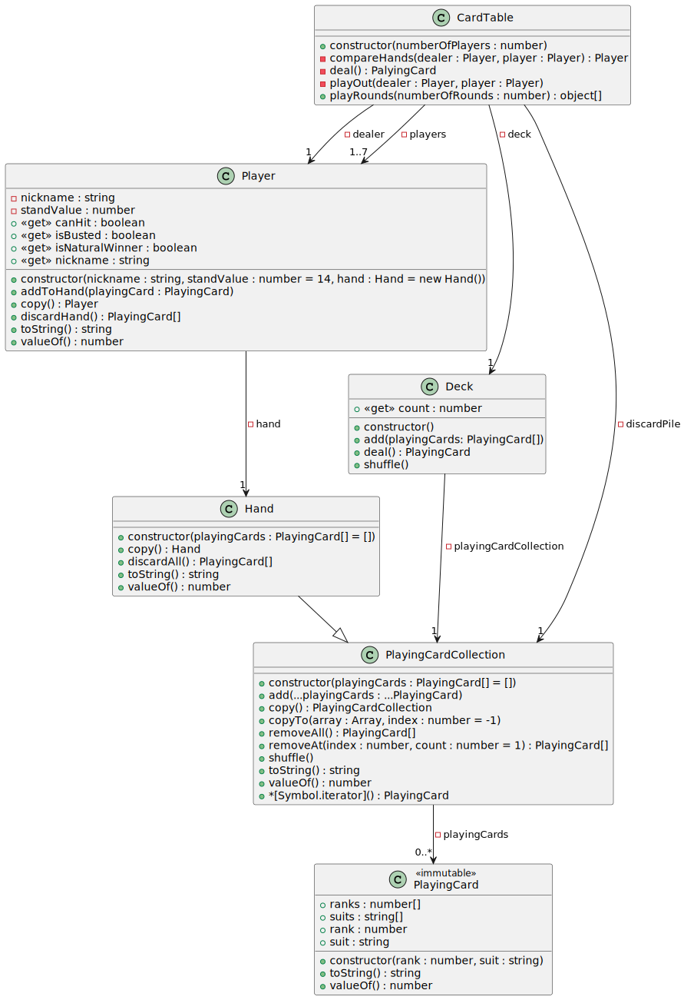

Beroendediagrammet visar beroendet mellan de moduler som kan härledas från klassdiagrammet.


## Klasser och deras medlemmar

Samtliga klasser och deras medlemmar måste implementeras exakt enligt klassdiagrammen. Inga ytterligare klasser eller medlemmar får läggas till.

### CardTable

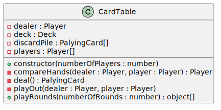

#### Fält

- `dealer`, privat fält som refererar till ett `Player`-objekt representerande given.
- `deck`, privat fält som refererar till det `Deck`-objekt som representerar kortleken (draghögen) kort dras från för att ge till spelare och giv.
- `discardPile`, privat fält för slänghögen, som representeras av ett `PlayingCardCollection`-objekt.
- `players`, privat fält för spelarna, en samling med referenser till `Player`-objekt.

#### Metoder

- `constructor`, konstruktorns uppgift är att initiera nödvändiga privata medlemmar.
- `compareHands`, privat metod som jämför två spelares händer och returnerar vinnaren.
- `deal`, privat metod som returnerar nästa spelkort från kortleken.
- `playOut`, en spelomgångs delomgång under vilken en spelare drar kort för att given därefter drar sina kort.
- `playRounds`, publik metod vars parameter bestämmer hur många spelrundor som ska spelas. Resultat från spelrundornas delomgångar lagras och returneras.

### Deck

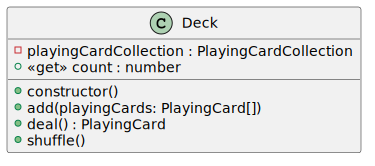

#### Fält

- `playingCardCollection`, privat fält med kortlekens kort, som representeras av ett `PlayingCardCollection`-objekt.

#### Egenskaper

- `count`, publik "readonly"-egenskap som returnerar antalet kort i kortleken.

#### Metoder

- `constructor`, konstruktorns uppgift är att initiera nödvändiga privata medlemmar.
- `add`, publik metod som lägger till kort i slutet av kortleken.
- `deal`, publik metod som tar bort det översta kortet i kortleken och returnerar det.
- `shuffle`, publik metod som blandar korten i kortleken.

### Hand

`Hand` ärver från `PlayingCardCollection`.

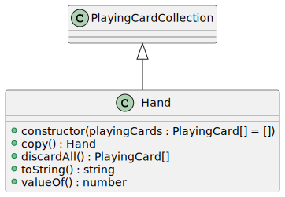

#### Metoder

- `constructor`, konstruktorns uppgift är att initiera nödvändiga privata medlemmar.
- `copy`, publik metod som returnerar en djup kopia av aktuellt objekt.
- `discardAll`, publik metod som tar bort samtliga kort från aktuellt objekt och returnerar dem.
- `toString`, publik metod som returnerar en sträng representerande aktuellt objekt (handens kort och deras samlade värde, eller ett streck om det inte finns några kort).
- `valueOf`, publik metod som returnerar ett tal representerande aktuellt objekt (samlade värdet av handens kort).

### Player

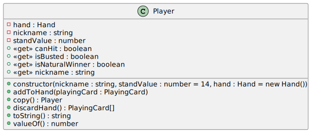

#### Fält

- `hand`, privat fält refererande till en samling innehållande de kort som utgör spelarens hand.
- `nickname`, privat fält för spelarens smeknamn.
- `standValue`, privat fält för det värde på handen upp till och med vilket spelaren fortsätter att dra kort.

#### Egenskaper

- `canHit`, "readonly"-egenskap som returnerar `true` om en spelare vill dra ett kort; annars `false`.
- `isBusted`, "readonly"-egenskap som returnerar `true` om en spelare har spruckit, d.v.s. då handens värde är större än 21; annars `false`.
- `isNaturalWinner`, "readonly"-egenskap som returnerar `true` om en spelare är en naturlig vinnare; annars `false`.
- `nickname`, "readonly"-egenskap som kapslar det privata fältet `nickname`och returnerar en spelares smeknamn.

#### Metoder

- `constructor`, konstruktorns uppgift är att initiera nödvändiga privata medlemmar.
- `addToHand`, publik metod som lägger till ett kort till spelarens hand.
- `copy`, publik metod som returnerar en djup kopia av aktuellt objekt.
- `discardHand`, publik metod som tar bort samtliga kort från spelarens hand och returnerar dem.
- `toString`, publik metod som returnerar en sträng representerande aktuellt objekt (spelarens namn samt korten spelaren har på sin hand och dess värde, eller ett streck om handen är tom).
- `valueOf`, publik metod som returnerar ett tal representerande aktuellt objekt (värdet av spelarens hand).

### PlayingCard

>👉 Denna klass finns redan och är fullständigt implementerad och __får inte modifieras__!
>
>👉 Objekt instansierade av klassen är "immutable" (genom `Object.freeze(this)` sist i konstruktorn) och kan inte förändras på något sätt efter att de skapats.


#### Fält

- `ranks`, publikt statiskt fält refererande till en frusen samling av möjliga värden kort kan ha.
- `suits`, publikt statiskt fält refererande till en frusen samling av möjliga färger kort kan ha.

#### Egenskaper

- `rank`, publik egenskap representerande ett korts värde.
- `suit`, publik egenskap representerande ett korts färg.

#### Metoder

- `toString`, publik metod som returnerar en sträng representerande aktuellt objekt (kortets värde följt av dess färg).
- `valueOf`, publik metod som returnerar ett tal  representerande aktuellt objekt (kortets värdet).

### PlayingCardCollection

>👉 Du kommer eventuellt inte att använda samtliga medlemmar i den lösning. Samtliga medlemmar måste dock fullständigt implementeras.
>
>👉 Klassen innehåller en medlem som gör det möjligt att iterera igenom en instans. Du hittar mer information under rubriken ["User-defined iterables"](https://developer.mozilla.org/en-US/docs/Web/JavaScript/Guide/Iterators_and_Generators#user-defined_iterables) på MDN.

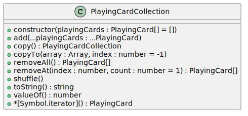

#### Fält

- `playingCards`,  privat fält för referens till array med referenser till `PlayingCard`-objekt.

#### Egenskaper

- `count`, publik "readonly"-egenskap som returnerar antalet element i den privata arrayen.
- `isEmpty`, publik "readonly"-egenskap som returnerar `true` om den privata arrayen inte innehåller några element; annars `false`.

#### Metoder

- `constructor`, konstruktorns uppgift är att initiera nödvändiga privata medlemmar.
- `add`, publik metod som lägger till referenser till `PlayingCard`-objekt i slutet av den privata arrayen.
- `copy`, publik metod som skapar och returnerar en djup kopia av aktuell instans.
- `copyTo`, publik metod som kopierar hela `PlayingCardCollection` till en array, med start vid det angivna indexet för målarrayen.
- `removeAll`, publik metod som tar bort alla spelkort från den här samlingen.
- `removeAt`, publik metod som tar bort ett eller flera spelkort från den här samlingen.
- `shuffle`, publik metod som blandar samlingen av spelkort på plats.
- `toString`, publik metod som returnerar en sträng representerande aktuellt objekt (samtliga kort i samlingen).
- `valueOf`, publik metod som returnerar ett tal representerande aktuellt objekt (värdet av samtliga kort i samlingen).
- `*[Symbol.iterator]`, publik iteratormetod som generator gör det enkelt att erbjuda en möjlighet att iterera igenom den privata arrayen.
